# Pinnacle 100 Gateway - Project Setup

## Overview
***

This project uses the Zephyr RTOS. More info can be found here.

Visual Studio Code is used as the IDE.

## Step 1 - Install Visual Studio Code
***
Download and install Visual Studio Code from here: [https://code.visualstudio.com/download](https://code.visualstudio.com/download)

## Step 2 - Install nRF Connect Desktop
***
Download and install nRF Connect Desktop from here: [https://www.nordicsemi.com/Products/Development-tools/nRF-Connect-for-desktop/Download#infotabs](https://www.nordicsemi.com/Products/Development-tools/nRF-Connect-for-desktop/Download#infotabs)

## Step 3 - Install nRF Connect SDK
***

Launch nRF Connect for Desktop installed in the previous step.
Scroll through the apps list until you find the toolchain manager. Click the install button to install.

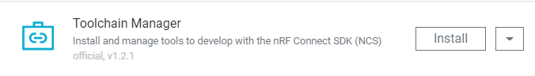

&nbsp;

Once installed, click "Open" to open the toolchain manager.
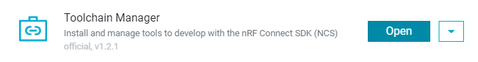

&nbsp;

This project uses SDK v2.2.0. In the Toolchain Manager find nRF Connect SDK v2.2.0 and click install.

> **Note**
> The SDK is quite large so expect the installation to take some time.

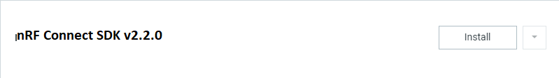

&nbsp;

## Step 4 - Visual Studio Code Setup
***
> **Note**
> Before continuing with this step, make sure all VSCode windows are closed and the program is not running.

In the toolchain manager, click the "Open VS Code" button.
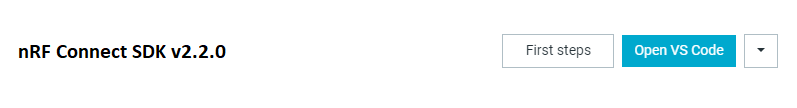

&nbsp;

If the required extensions are not already installed, the following dialog will appear. Select the "Install missing extensions" button.
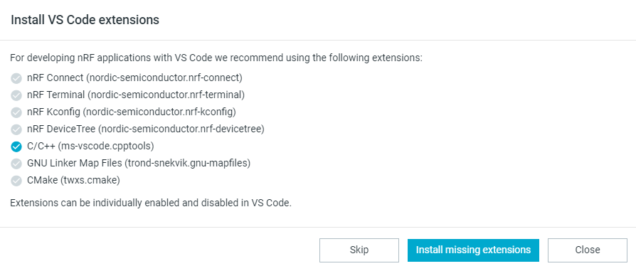

&nbsp;

After the installations are complete. Select the "Open VS Code" button.
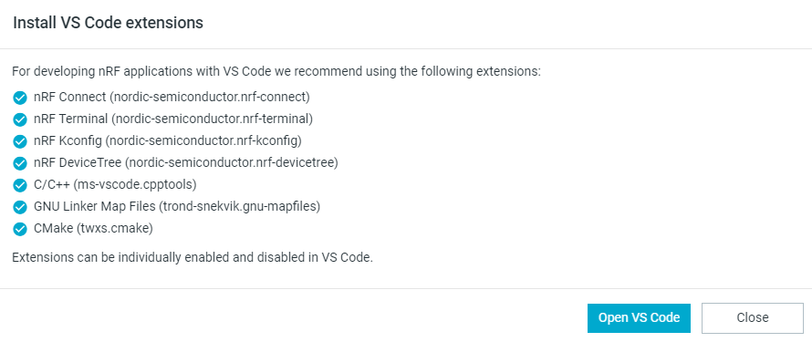

&nbsp;

## Step 5 - Open the Project
***
Select the nRF Connect extension in the toolbar. From the list, then select "+ Add an existing application"

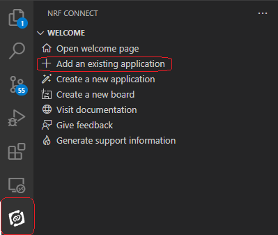

&nbsp;

Select the project directory as the project to open.

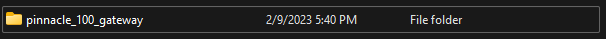

&nbsp;

As the project is opening, you may see the following prompt at the bottom-right of the window. Select "Yes".

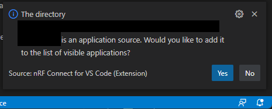

Now that the application is opened, a build configuration must be added for your environment.

Click the "No build configurations" list item to create a new one.

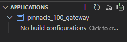

&nbsp;

Select the "Custom boards" option and check the "Enable debug options" option, then press the "Build Configuration" button.

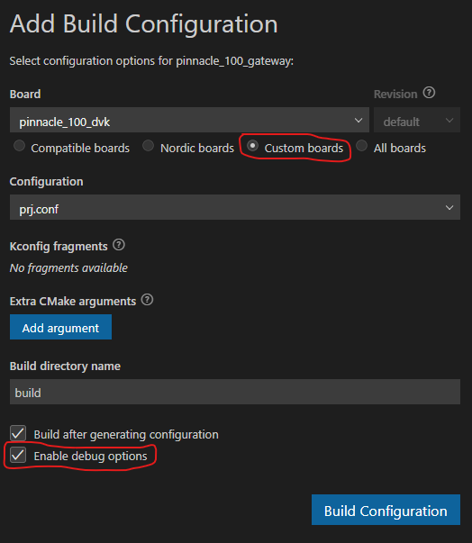

&nbsp;

The project will now build. Click the dialog to open the build output terminal.

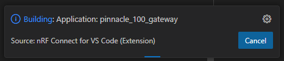

&nbsp;

When the build is complete, the output will appear as follows.

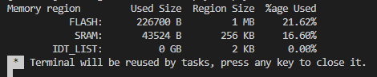

&nbsp;

## Step 6 - Build and Flash
***
To build the project after changes, select the "Build option in the "Actions" list. Or, press the circular arrow icon to perform a "Pristine" build.

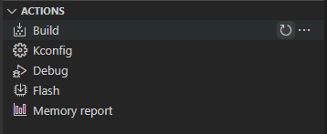

&nbsp;

To build the project after changes, select the "Flash" option in the "Actions" list. Or, press the chip icon to erase before flashing.

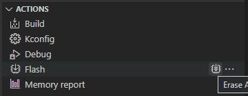

&nbsp;